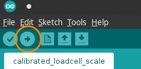
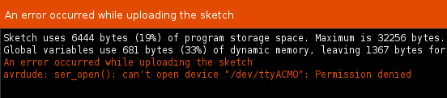
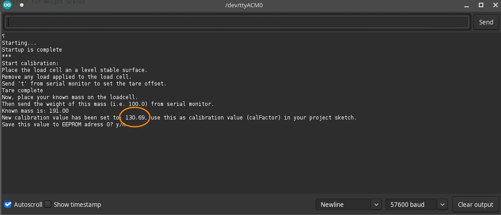

# Anleitung
1. Einleitung  -> Jan
2. Material und Werkzeug  -> Merve
3. Anleitung für Kasten  -> Aldin
4. Anleitung für Waage  -> Jan
   - Schaltplan (Fritzing, AutoCAD)
5. Anleitung für Installation  -> Fabi

# MicroChangeProjectBen
A smart bin that helps you by reducing your garbage production

# Installationsanleitung

<mark style="background-color: orange; border-radius: 4px;">
WICHTIG:
</mark>

Bevor du fremden Code, wie z.B. eine Skript-Datei `run.sh` ausführst, vergewissere dich, dass die Datei keinen schädlichen Code beinhaltet.
Das ist besonders wichtig, wenn du aufgefordert wirst solch ein Skript mit Adminrechten auszuführen (`sudo <befehl>` führt ein Kommando mit Adminrechten aus)

In der folgenden Anleitng wird davon ausgegangen, dass auf allen Geräten entweder Raspbian/Raspberry OS oder Ubuntu verwendet wird. Die Installation kann auch auf anderen Betriebssystemen ausgeführt werden, weicht dann aber unter Umständen von den angegebenen Schritten und Befehlen ab.

## Raspberry Pi Setup

Als erstes muss der Raspberry Pi einsatzbereit gemacht werden. Die folgenden Schritte erklären wie der Raspberry Pi sowie das Touchdisplay für die weitere Installation vorbereitet werden.

### Benötigte Utensilien

- Ein Laptop oder Desktop Rechner
- Raspberry Pi mit passender SD-Karte
- 7" Raspberry Pi Touchdisplay 
- Eine Maus und Tastatur, die mit dem Raspberry Pi verbunden werden können

### Setup

1. Flashe die SD-Karte mit der aktuellsten stable Version von Raspbian bzw. Raspberry OS und stecke sie in den Raspberry Pi

2. Starte den Raspberry Pi und öffne ein Terminal (`Strg + Alt + T`) und update die Software mit:
```bash
sudo apt update && sudo apt upgrade -y
```

3. Ändere die Datei `/boot/config.txt` wie hier auf der folgenden Website, unter dem Punkt `Software setting`, beschrieben (https://www.waveshare.com/wiki/7inch_DSI_LCD)  

**Kurze Zusammenfassung**

Entkommentiere den folgenden Teil der Datei:
```
#camera_auto_detect=1
#dtoverlay=vc4-kms-v3d
```

Füge den folgenden Teil unter dem Punkt `[all]` hinzu:
```
dtoverlay=vc4-fkms-v3d
start_x=1
```

4. Fahre den Raspberry Pi runter

5. Verbinde das DSI Display und starte dann den Raspberry Pi wieder

6. Das DSI Display sollte jetzt funktionieren und wir können mit dem Rest der Installation fortfahren.


## Arduino Setup

Im folgenden Teil wird erklärt wie die benötigte Software auf den Arduino Uno gespielt wird. Damit dieser Teil vollständig durchgeführt werden kann, muss der Arduino Uno vollständig verkabelt und mit der Waage verbunden sein. Das ist nötig, da die Software für den Arduino mit den Kalibrierungsdaten der Waage angepasst werden muss.

### Benötigte Utensilien

- Ein Laptop oder Desktop Rechner
- Arduino Uno (mit Waage verbunden)
- Raspberry Pi

### Setup

1. Installiere die Arduino IDE auf dem Laptop bzw. Desktop PC
```bash
sudo apt install arduino
```

2. Wenn du es noch nicht getan hast, dann Klone das Git Repository für dieses Projekt mit:
```bash
git clone git@github.com:cbm-instructions/micro-change.git
```

3. Öffne die Arduino IDE und installiere die Library `HX711_ADC` von Olav Kallhovd (https://github.com/olkal/HX711_ADC) wie folgt:  
In der IDE klicke auf `Tools > Manage Libraries`  
dann suche nach `HX711_ADC` und klicke bei der oben beschriebenen Library auf `Install`.

4. Wenn die Library installiert ist kannst du das Kalibierungsprogramm laden. Das funktioniert wie folgt:  
In der IDE klicke auf `File > Examples > HX711_ADC > Calibration`.  
Es sollte sich ein neues Fenster geöffnet haben.

5. Das in Schritt 4 geöffnete Programm muss zweimal (einmal für jede Wägezelle) durchgeführt werden. Um das zu tun müssen für jede Wägezelle zwei Ports angegeben werden. Diese Nummern der Ports entsprechen den Nummern der Anschlüsse auf dem Arduino, die für die Wägezellen verwendet wurden.  
In der geöffneten Datei `Calibration`, suche folgende Stelle:
```c++
//pins:
const int HX711_dout = 4;
const int HX711_sck = 5;
```
Ändere sie für die erste Kalibrierung auf:
```c++
//pins:
const int HX711_dout = 5;
const int HX711_sck = 6;
```

Starte jetzt die erste Kalibrierung. Klicke dafür auf den Button mit dem Pfeil. 



Um die Kalibrierung durchzuführen musst du den Serial Monitor öffnen. Klicke dazu auf `Tools > Serial Monitor`. Falls du die Meldung `ser_open(): can't open device "/dev/ttyACM0": Permission denied` bekommst, öffne ein Terminal und führe das folgende Kommando aus:
```bash
sudo chmod a+rwx /dev/ttyACM0
```
Der Pfad in der Fehlermeldung kann auch abweichen. In diesem Fall sollte das obige Kommando mit dem entsprechneden Pfad ausgeführt werden.

**Beispiel der Fehlermeldung:**



Stelle den Serial Monitor auf den Port 57600. Du solltest jetzt eine Ausgabe bekommen. Befolge die Anweisungen der Ausgabe. Die Ausgabe einer kompletten Kalibrierung sieht wie folgt aus:



Notiere den Wert der Kalibrierung für die erste Zelle.  
**Beispiel:**
```
LoadCell_1 (5/6) = 130.59
```

Führe die Kalibrierung auch für die zweite Wägezelle mit den Pins 10 und 11 durch. 
Ändere sie für die zweite Kalibrierung auf:
```c++
//pins:
const int HX711_dout = 10;
const int HX711_sck = 11;
```

Danach solltest du 2 Werte für die Kalibrierung haben.

**Beispiel**
```
LoadCell_1 (5/6)   = 130.59
LoadCell_2 (10/11) = 117.95
```

Jetzt müssen die Werte der Pins und der Kalibrierungen nur noch in das Programm für die Waage eingefügt werden. Öffne hierzu die Datei `micro-change/arduino-scale/calibrated_loadcell_scale/calibrated_loadcell_scale.ino` und ändere die sie wie folgt ab:
```c++
const int HX711_dout_1 = 5;  // Ändere von 4 -> 5
const int HX711_sck_1 = 6;   // Ändere von 5 -> 6
const int HX711_dout_2 = 10; // Ändere von 6 -> 10
const int HX711_sck_2 = 11;  // Ändere von 7 -> 11

// ... snippet ...

void setup() {
  
  // ... snippet ...

  calibrationValue_1 = 130.59; // Kalibrierung für 1. Wägezelle
  calibrationValue_2 = 117.95; // Kalibrierung für 2. Wägezelle
```

Speichere nun die Datei und spiele das Programm auf den Arduino indem du den Pfeil-Button drückst.


Wenn das Programm ohne Fehler auf den Arduino geladen wurde, kannst du diesen von deinem Laptop/Desktop entfernen und an den Raspberry Pi anschließen.

## Installation der Anwendung auf dem Raspberry Pi

### Benötigte Utensilien

- Ein Laptop oder Desktop Rechner
- Ein USB-Stick oder ein ähnlicher Datenträger, der sowohl mit dem Laptop/Desktop als auch mit dem Raspberry Pi verbunden werden kann
- Eine Maus und Tastatur, die mit dem Raspberry Pi verbunden werden können

### Benötigte Software auf dem Raspberry Pi

- Python 3 (sollte bereits installiert sein)  
```
sudo apt install python3
```

### Build and Run

Das Projekt sollte am besten nicht auf dem Raspberry Pi gebaut werden, da es dort zu Problemen mit der Anzahl an Node Packages kommen kann. Deshalb sollte hierfür ein Laptop oder Desktop Rechner verwendet werden.

- Öffne ein Terminal (`Strg + Alt + T`)

- Klone das Git Repo:
```bash
git clone git@github.com:cbm-instructions/micro-change.git
```

- Wechsle in den Ordner des Repos und dann in den Order 'bin-client'
```bash
cd micro-change/bin-client
```

- Installiere die benötigten Node-Packages
```bash
npm i
```

- Navigiere zurück zum Ordner des Repository
```bash
cd ..
```

- Mache die Datei `build_and_bundle_for_usb.sh` ausführbar.
```bash
chmod a+x build_and_bundle_for_usb.sh
```

- Führe die Datei `build_and_bundle_for_usb.sh` aus. Bevor du die Datei ausführst stelle sicher, dass sich in `bin-client` kein Ordner mit dem Namen `dist` befindet, falls doch lösche ihn. Dieser Prozess kann ein wenig dauern.  
**Befehl:**
```bash
./build_and_bundle_for_usb.sh
```

- Kopiere den Ordner `ben_bundle`, der beim vorigen Schritt entstanden ist, auf den USB-Stick.

- Schließe den USB-Stick an den Raspberry Pi an und verschiebe den Ordner `ben_bundle` auf den Raspberry Pi

- Öffne auf dem Raspberry Pi ein Terminal (`Strg + Alt + T`) und navigiere in den Ordern `ben_bundle`

- Mache die Skript-Dateien `setup.sh` und `run.sh` ausführbar.
```bash
chmod a+x setup.sh run.sh
```

- Führe die Datei `setup.sh` aus. Dieser Prozess kann ein wenig dauern.
```bash
./setup.sh
```

- In diesem Schritt wird die Anwendung gestartet. Damit die Anwendung richtig funktioniert muss der Arduino vollständig verkabelt und mit der angepassten Software für die Waage bespielt sein.  
Wenn `setup.sh` erfolgreich ausgeführt wurde, kannst du die Anwendung durch die Datei `run.sh` starten.
```bash
./run.sh
```

Falls `run.sh` die Anwendung nicht vollständig startet tue folgendes:

1. Öffne zwei Terminalfenster (`Strg + Alt + T`)

2. Im ersten Terminalfenster, navigiere nach `ben_bundle/scale-data-recorder` und führe folgenden Befehlt aus:
```bash
pip3 install --editable . && python3 recorder.py
```

3. Im zweiten Terminalfenster, navigiere in den von `setup.sh` erstellten Ordner `ben_bundle/squashfs-root` und führe folgenden Befehl aus:
```bash
./bin-client
```

Die Anwendung sollte nun vollständig starten.  
**Glückwunsch!** Du kannst nun BEN verwenden und deinem Ziel nach einer besseren Umwelt ein Stück näher kommen.